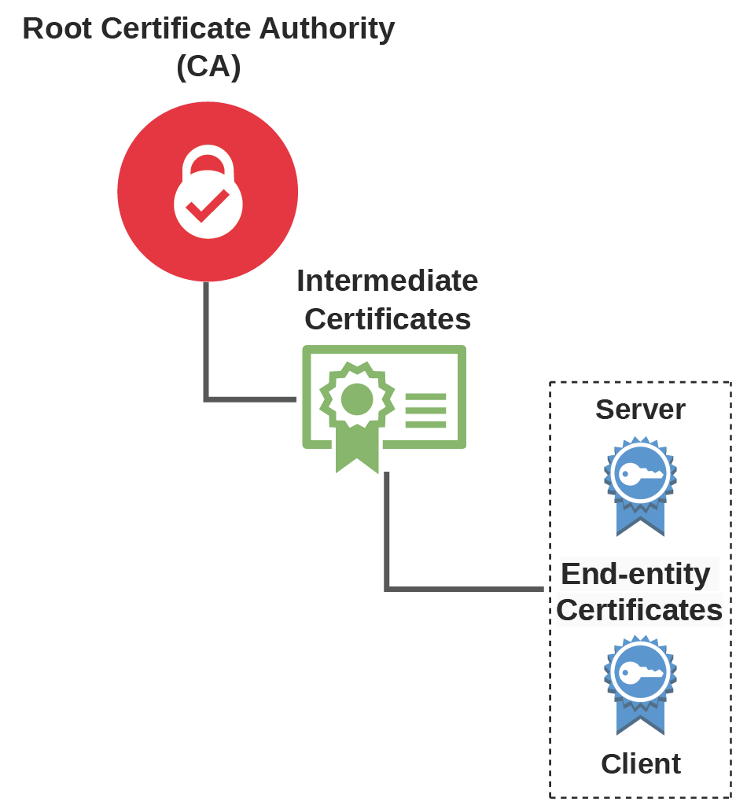

	 

## Overview
This tools in this repo can be used to:
1. [pqsetup.sh](pqsetup.sh)  
Can be used to install [LibOQS](https://github.com/open-quantum-safe/liboqs) and the [OQS Provider](https://github.com/open-quantum-safe/oqs-provider), right now typically for research & testing with post-quantum cryptographic algorithms. It is important to note that this script **only installs**, it **does not activate**. See [here](https://github.com/open-quantum-safe/oqs-provider/blob/main/USAGE.md#activation) for details on activation.

2. [mkcerts.sh](mkcerts.sh)  
Can be used to quickly create CA infrastructure & accompanying certificates for:
    - Root CA
    - Intermediate CA
    - OCSP signing
    - TLS Server
    - TLS Client
  Using several different digital signature algorithms as listed in ALGS at the top of the script. For a list of available algorithms, refer [here](https://github.com/open-quantum-safe/oqs-provider?tab=readme-ov-file#signature-algorithms)
4. [openssl.cnf](openssl.cnf)  
Is the accompanying config file for proper execution of #2. You can modify as needed if necessary. Key sections are listed below: <pre>[RootCA]</pre> <pre>[InterCA]</pre> <pre>[v3_ca]</pre> <pre>[v3_ocsp]</pre> <pre>[v3_server]&ast;</pre>  <pre>[v3_client]&ast;</pre> 
&ast; - It is particularly important to edit the *authorityInfoAccess* attribute under these sections, as this defines the endpoint for OCSP verification.

## Requirements
*pqsetup.sh* is written and tested only with Ubuntu & Debian operating systems, and will likely fail on any non-Debian based distro. It should be fairly simple to manipulate the script to consider other OSes as the restriction is primarily due to the use of the **apt** package manager for installing packages. This process in general has been made much easier with the release of the OQS Provider as opposed to a special OpenSSL install, so it is really not an issue -- the script is honestly no longer even really needed.

*mkcerts.sh* should work fine on any Linux OS, provided the variables have been appropriately configured.

## Usage
**BEFORE** running anything, open the script in your editor of choice, look for the below section at the top of the script: 
<pre>###############################################################################
################################## IMPORTANT ##################################
###############################################################################</pre>
This section has parameters that **MUST** be appropriately set for proper execution. The default values should work fine, but you will likely want to customize certain attributes, such as the certificate subject details, passphrase, etc.

Once you are satisfied with the configuration, simply `./<script name>` to run the script

## Notes
- The scripts in this repo _may_ not be executable by default.
- If [activating OQS Provider](https://github.com/open-quantum-safe/oqs-provider/blob/main/USAGE.md#activation) by config file (easiest), you are required to also explicitly activate the default provider. Failure to do so may break your system's OpenSSL install. A sample [openssl.cnf](https://github.com/oneparchy/PQ-Cert-Kit/blob/main/openssl.cnf) file is included in this repo for convenience.
